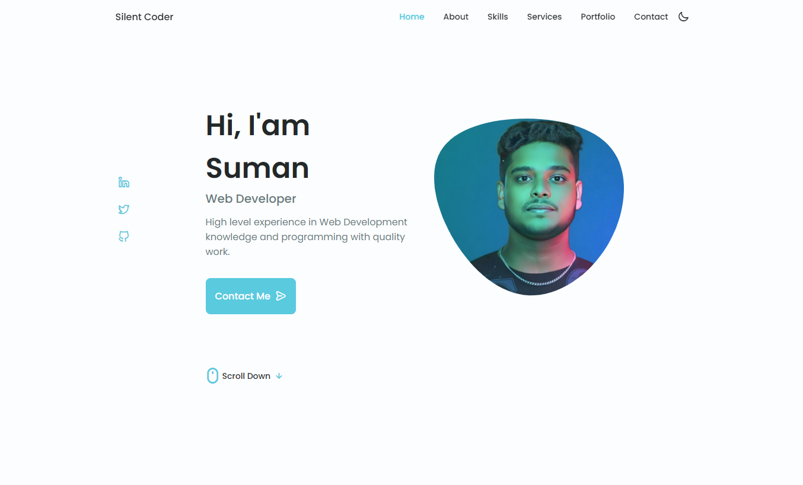

# Silent Coder - Personal Portfolio Website
## Light Mode

## Dark Mode


This is a personal portfolio website for showcasing web development skills and projects. The website is designed to be a professional and clean representation of a web developer's skills, services, and portfolio.

## Features

- **Responsive Design:** The website is fully responsive and works on all devices.
- **Modern UI:** A clean and modern user interface.
- **Interactive Elements:** Smooth scroll, contact button, and social media links.
- **Skills Section:** Highlighting the key skills.
- **Services Section:** Detailing the services provided.
- **Portfolio Section:** Showcasing past projects.
- **Contact Section:** Form to get in touch.

## Demo

You can view a live demo of the website [here](https://silentcodersuman.000webhostapp.com).

## Getting Started

Follow these instructions to get a copy of the project up and running on your local machine.

### Prerequisites

You need a web browser to run this project.

### Installation

1. Clone the repository:
   ```bash
   git clone https://github.com/sumanbiswas9/Suman-s-Portfolio.git
   cd Suman-s-Portfolio
   open index.html


## Credits

* Swiper JS: [https://swiperjs.com/](https://swiperjs.com/)
* Main JS: Custom script for this website

## License

&copy; Silent_Coder. All rights reserved.
